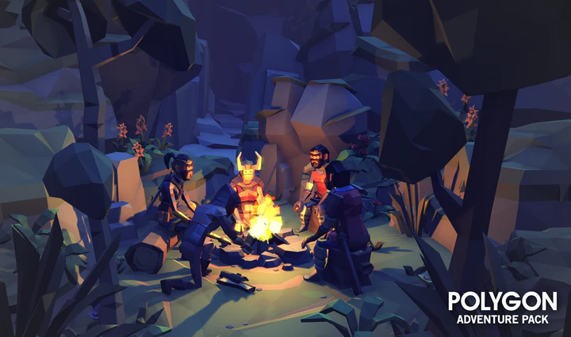
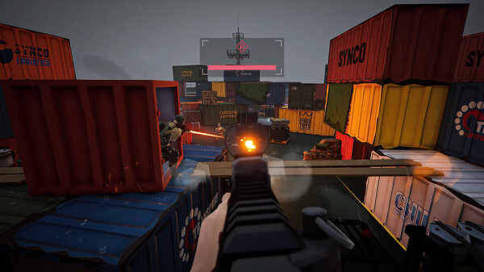
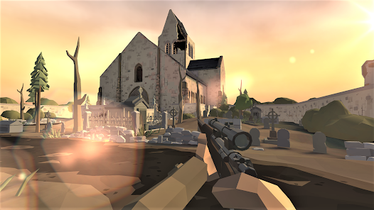
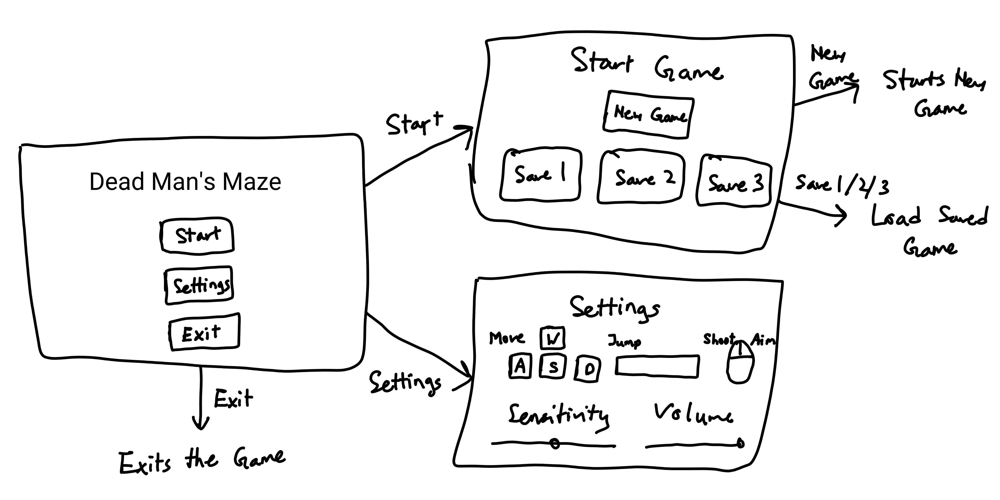
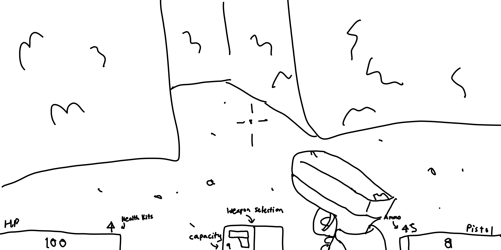

# Dead Man's Maze

**Game Design Document**

# Table of Contents

1. Game Description

- 1.1 Elevator Pitch
- 1.2 Summary
- 1.3 Unique Selling Points (USPs)

2. Design

- 2.1 Key Mechanics
- 2.2 Characters and Settings

3. Gameplay

- 3.1 Beginning the Game
- 3.2 First 2-5 minutes

4. Visual-Audio

- 4.1 Art Style
- 4.2 Audio
- 4.3 Front End

5. Production

- 5.1 SWOT Analysis
- 5.2 Production Schedule

6. Prototyping

7. List of All Assets

8. The Team

# 1. Game Description

## 1.1 Elevator Pitch

## 1.2 Summary

## 1.3 Unique Selling Points (USPs)

# 2. Design

## 2.1 Key Mechanics

## 2.2 Characters and Settings

# 3. Gameplay

## 3.1 Beginning the Game

## 3.2 First 2-5 minutes

# 4. Visual-Audio

## 4.1 Art Style

The art style will be a 3D polygon style which offers a timeless art style with colorful theme that makes the game unique and convey a playful feel. The game will use 3D polygon assets by Synty as much as possible to provide a consistent art style throughout the entire game including characters, items, building and the environment. Where a specific asset is unavailable, a custom model with texture will be made to resemble the art style as much as possible.

*Figure 4.1: Polygon Adventure Pack (Campfire) Preview by Synty*

The gameplay style will be similar to POLYGON and , both are tactical first person shooter. The game will feature responsive controls, coupled with fast and fluid animation. The player can control the character to move, sprint, jump, crouch and shoot with polygon weapons to match the game's art style. The game will put heavy emphasis on gunplay with impactful shots at every bullet strike and shells ejecting from the gun, coupled with satisfying reload animations.

*Figure 4.2: POLYGON*

*Figure 4.3 World War Polygon*

## 4.2 Audio

On the start menu, the game will play an orchestral music to set the mood of the player to get ready to play, similar to Polyfield. Once in the game, the music will change between 2 states depending on what the player is doing. If the player has encountered an enemy, the music will get louder with fast tempo, otherwise the music will be quite with mellow tone.

As for the environmental sound, the sound will give a isolation settings.

## 4.3 Front End

Upon starting the game, the player will be greeted with the start menu and a beautiful artwork in the background to invite the player to play the game. The menu UI will consists of a 'Start', 'Settings' and 'Exit buttons and leads to another menu page as shown in the wireframe below:

*Figure 4.4: Start Menu Wireframe*

The game will feature a simple HUD system with slight transparency to allow the player immersive themselves in the gameplay without being distracted by complicated HUD. It consists of the health bar, ammo bar and gun selection slots as shown in the illustration below: 

*Figure 4.5: Gameplay with HUD Illustration*

# 5. Production

## 5.1 SWOT Analysis

## 5.2 Production Schedule

# 6. Prototyping

# 7. List of All Assets

# 8. The Team

| Role                   | Name                | ID        |
| ---------------------- | ------------------- | --------- |
| Project Manager        | Isabela de Oliveira |           |
| Programming            | Raymond Woon        | 190126210 |
| Art                    | Alwin Wong          | 200195717 |
| Design                 | Ernesto Arakaki     |           |
| Quality Assurance (QA) | Daniel Rodriguez    |           |
