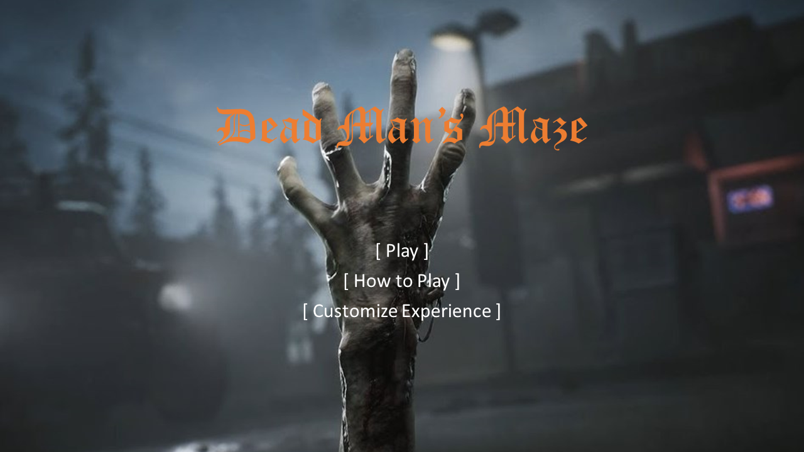
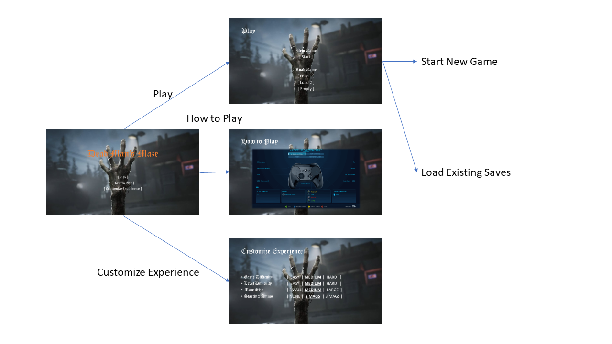

# Dead Man's Maze

**Game Design Document**

# Table of Contents

1. Game Description

- 1.1 Elevator Pitch
- 1.2 Summary
- 1.3 Unique Selling Points (USPs)

2. Design

- 2.1 Key Mechanics
- 2.2 Characters and Settings

3. Gameplay

- 3.1 Beginning the Game
- 3.2 First 2-5 minutes

4. Visual-Audio

- 4.1 Art Style
- 4.2 Audio
- 4.3 Front End

5. Production

- 5.1 SWOT Analysis
- 5.2 Production Schedule

6. Prototyping

7. List of All Assets

8. The Team

# 1. Game Description

## 1.1 Elevator Pitch

An atmospheric difficulty increasing horror first-person shooter in which the player must escape a maze by first finding the keys to the exit and then surviving the path to the exit.

## 1.2 Summary

It is a first-person shooter (FPS) game that places the player inside a randomly generated maze with very limited lightning to convey a moody experience. The atmosphere will express heavily on sound, where the player will constantly hear moans, steps, and scratching sounds coming from the monsters in proximity, and the player can choose to either avoid it or take it out.

The objective is to escape the maze by collecting keys to the exit. The player will start with limited ammunition for self-defense, where the player can get more ammo from randomly placed pickups within the maze. The game is highly replayable since the mazes are randomly generated with maze customization accessible for the player to change and explore.

## 1.3 Unique Selling Points (USPs)

- The mazes are randomly generated which means that the players will theoretically obtain endless variations of the mazes to experience
- The properties of the randomly generated mazes can be customized by the players which includes the enemy difficulty (health and speed), level difficulty, maze sizes and starting ammo, which allows the player to experience the game to their heart's content
- The horror experience from the moody atmosphere and spooky monsters will be enhanced by the scary sound coming from the monster to ensure as much immersion to the players

# 2. Design

## 2.1 Key Mechanics

The game is viewed from a first-person perspective of the main character where the player can control. The character can move forwards and backwards, strafe to the sides, rotate, look up and down. The player will also have a small set of weapons to fight against enemies. To achieve the game's goal of getting all the collectables and reaching the exit, the player will navigate the maze, avoiding or eliminating encountered threats that populates the maze. Eliminating the threats will require skill, as the player will have limited ammunition to kill enemies. In case the player runs out of ammo, the only option is to avoid combat entirely, thus increasing the difficulty traversing the maze.

The game mechanics of this game consists of navigating the maze, finding the keys to the exit and shooting enemies. The novelty of game's proposal is that the maze is generated randomly for each new game to make it more engaging for replayability. The game also features a "hot/cold" mechanic to help with relieving some frustration to the player to find the key, which may make the game more appealing to broader audience while still retaining an unsettling feeling. While FPS shooting games and survival horror games are very popular, Dead Man’s Maze will combine elements of both genres, while also removing the certainty of maze's map to make it more challenging. The possibility to quickly start a new game and get a new maze to explore will be appealing to both amateur and experienced players that look for a different maze gameplay experience.

## 2.2 Characters and Settings

The game is set in the Modern day. Earth is close to being decimated by a virus that has caused the infected to turn into zombie-like creatures. Dr. Alex Fleming, an army medical doctor is tasked with coming up with a cure, and he thinks he just needs one more ingredient in order for it to be effective – the sweet-smelling herb Athelas. The only problem? Athelas is only known to grow in one place in the world: A remote farm in the south of France, whose owner had a twisted idea of growing the lifesaving plant in the middle of a maze that he had constructed himself to keep it out from the hands of his enemies. Dr. Fleming and his team travel to the farm, and cautiously begin to enter the maze to retrieve the Athelas, when they realize the farm has been overrun with zombies! It's up to the player to help Dr. Fleming work his way through the maze using the few weapons in his arsenal to survive and retrieve the Athelas, while also making it out alive, hopefully in time to save humanity!

# 3. Gameplay

## 3.1 Beginning the Game

The player is greeted with a dark menu screen and eerie music, where they get the options to start the game, read the instructions or customize various aspects of the game, it could look something like the illustration below:

*Figure 1: Main Menu*

Once the player clicked on "Play" and "Start" to start a new game, the game will start with the player placed in random spot in the maze followed by a popup screen explaining the lore and your objective. The player can click on "Continue" to begin the game.

## 3.2 First 2-5 minutes

The player has a flashlight that will flicker from time to time giving the situation a sense of uncertainty and helplessness. Sound will be atmospheric, having muffled groans, scratching against walls, uneven footsteps and dragging across the floor to give the player a sense that they are not alone in this maze. The player will begin to move the character forwards, backwards and sideways using the WASD keys on the keyboard and moving the camera using the Mouse. Upon encountering their first enemy (zombie), the player may choose to turn around and try to find a different route or fight. The player will have a certain amount of health which can be quantified similar to the "Call of Duty" games where the bloodier/redder the screen is, the fewer health points the player has. The player will walk around and shoot enemies in tight corridors (helps generate the common fear of claustrophobia) and will search for keys/items needed to open the exit, the player may be able to find the exit early on but without the keys they will not be able to beat the game. The player will get a very dim sound prompt when they are close to a key and it will intensify or diminish the closer they get. This "hot/cold" mechanic can help relieve some of the frustration a player may feel thus making the game appealing to a broader audience while still retaining an unsettling feeling.

# 4. Visual-Audio

## 4.1 Art Style

The game's art style follows a 3D polygon style which offers a timeless art style with colorful theme that makes the game unique and convey a playful feel. The game will use 3D polygon assets by Synty as much as possible to provide a consistent art style throughout the entire game including characters, items and the environment. Where a specific asset is unavailable, a custom model with texture will be made to resemble the art style as much as possible.

*Figure 4.1: Polygon Adventure Pack (Campfire) Preview by Synty*

The gameplay style will be similar to POLYGON and World War Polygon, both are tactical first person shooter. The game will feature responsive controls, coupled with fast and fluid animation. The player can control the character to move, sprint, jump, crouch and shoot with polygon weapons to match the game's aesthetics. The game will put heavy emphasis on gunplay with impactful shots at every bullet strike and shells ejecting from the gun, coupled with satisfying reload animations. Once a bullet hits an enemy, the crosshair will show a red indicator to confirm that the shot hit an enemy. Conversely, once an enemy has been hit by a bullet, the enemy will do a flinch animation to show the enemy was hurt and if the enemy's health is empty, the enemy's ragdoll mode will be enabled as it lifelessly falls to the ground with collider physics.

*Figure 4.2: POLYGON*

*Figure 4.3 World War Polygon*

## 4.2 Audio

On the start menu, the game will play an orchestral music to set the mood of the player to get ready to play, similar to Polyfield. Once in the game, the music will change between 2 states depending on what the player is doing. If the player has encountered an enemy, the music will get louder with fast tempo to indicate suspense, otherwise there will be no music.

As for the environmental sound, the player will only hear silence with constant moans, steps and scratching sounds coming from the zombies in proximity. This gives the player sense of dread and stress that there may be something right around the corner in an isolated setting. Most of the sounds will play at random intervals so that the player may not find the audio cues predictable, but with certain spacing between them so that they feel organic and not part of a predictable algorithm.

## 4.3 Front End

Upon starting the game, the player will be greeted with the start menu and a beautiful artwork in the background to invite the player to play the game. The menu UI will consist of a 'Start', 'How to Play' and "Customize Experience" buttons and leads to another menu page as shown in the wireframe below:

*Figure 4.4: Start Menu Wireframe*

The game will feature a simple HUD system with slight transparency to allow the player to immersive themselves in the gameplay without being distracted by complicated HUD. It consists of the health bar, ammo bar and gun selection slots as shown in the illustration below:

*Figure 4.5: Gameplay with HUD Illustration*

# 5. Production

## 5.1 SWOT Analysis

The following SWOT analysis will offer a snapshot of our game's potential, highlighting areas for optimization and the challenges that lie ahead.

### Strengths

1. **Unpredictability**: This is our big win! The randomly generated maze layout ensures that players will experience a unique challenge each time they play, they can’t just memorize and breeze through, enhancing replayability.
2. **Tense Atmosphere**: Limited lighting and a focus on sound provide an intense, suspenseful atmosphere that is likely to engage fans of the horror genre.
3. **Resource Management**: By limiting the ammunition available to players and distributing it randomly throughout the maze, we encourage strategic thinking and maze exploration what will make the user encounter more enemies.

### Weaknesses

1. **Potential for Repetitiveness**: Despite the random maze generation, if gameplay mechanics and enemy encounters don't provide enough variety, players may find the experience monotonous over time, we are considering some ideas that could help on this point, like multiple kind of zombies, power ups and multiple types of guns but bear in mind those are future ideas not planned features.
2. **Niche Market**: Not everyone’s a fan of horror, and not everyone loves first-person shooters so the combination of the horror genre with a first-person shooter may limit the game's appeal.
3. **Accessibility Concerns**: Relying heavily on limited visual cues and auditory information could make the game less accessible to players with visual or auditory impairments. Incorporating accessibility options would be a possible future improvement.

### Opportunities

1. **Continuous Improvement**: The nature of random generation allows for an evolving gameplay experience. The maze-generating algorithm can be constantly improved which means the game can grow and get more complex over time.
2. **Community Engagement**: If the game is well-received, there is potential for a dedicated player community to form. This community could share experiences, tips, and strategies, promoting the game.

### Threats

1. **Technical Challenges**: Random generation can lead to some bugs or imbalances in gameplay, needing constant testing and debugging.
2. **Market Competition**: There are a lot of horror games out there, and a lot of shooters too so standing out in that crowd can be a challenge.
3. **Team Inexperience**: As our team does not have prior experience in game development, there could potentially be unforeseen difficulties.

## 5.2 Production Schedule

For the development of our game, we created a high-level production schedule covering project management, programming, art, design, and quality assurance, we will virtually meet every Wednesday to discuss progress and adjust tasks as needed besides that, we will keep the communication via Slack. The following timeline provides a roadmap, but we're prepared to adapt as needed in case of unexpected issues or necessary changes after feedback.

| Week Starting        | Isabela Louli            | Raymond Woon                | Alwin Wong               | Ernesto Arakaki          | Daniel Rodriguez                 |
| -------------------- | ------------------------ | --------------------------- | ------------------------ | ------------------------ | -------------------------------- |
| **Week 1 (July 24)** | Project Planning         | Project Planning            | Concept Art/Design       | Concept Art/Design       | Project Planning                 |
| **Week 2 (July 31)** | Player                   | Maze Generation Programming | Enemies Generation       | Maze components          | Weapons                          |
| **Week 3 (Aug 7)**   | Player interactions      | Level design                | Texture and assets       | Menu                     | Bullets                          |
| **Week 4 (Aug 14)**  | Game sounds              | Gameplay Programming        | Lights and atmosphere    | Inventory                | Weapons and Bullets interactions |
| **Week 5 (Aug 21)**  | Buffer/Rest Week         | Buffer/Rest Week            | Buffer/Rest Week         | Buffer/Rest Week         | Buffer/Rest Week                 |
| **Week 6 (Aug 28)**  | Feedback and Iteration   | Feedback and Iteration      | Feedback and Iteration   | Feedback and Iteration   | Feedback and Iteration           |
| **Week 7 (Sept 4)**  | Finalize Game Mechanics  | Finalize Game Mechanics     | Finalize Game Mechanics  | Finalize Game Mechanics  | Finalize Game Mechanics          |
| **Week 8 (Sept 11)** | Final Polish and Testing | Final Polish and Testing    | Final Polish and Testing | Final Polish and Testing | Final Polish and Testing         |

# 6. Prototyping

The repo that has the files of the prototype can be found here:

[Github Repo](https://github.com/RaymondWoon/Dead-Mans-Maze)

# 7. List of All Assets

| Type   | Name              | Description                                           |
| ------ | ----------------- | ----------------------------------------------------- |
| Script | Player Controller | Handles user input and controls in-game actions       |
| Script | Maze Generator    | Generates the layout of the maze                      |
| Script | Sounds Controller | Controls the sounds                                   |
| Script | Game Controller   | Keeps state of the game                               |
| Script | Inventory         | Keeps state of the player's items                     |
| Script | Lights Controller | Generates lights and lighting effects                 |
| Script | Menu              | Menu to start game, shows guides and configure maze   |
| Script | UIManager         | Manages UI elements of the game                       |
| Script | Bullet Controller | Handles interactions between bullets and game objects |
| Script | Enemy Spawner     | Creates new enemies                                   |
| Script | Enemy Controller  | Handles enemy behaviour                               |
| Prefab | Player            | Player's appearance, behaviour                        |
| Prefab | Enemy             | Enemy's appearance, behaviour                         |
| Prefab | Weapons           | Bundle of weapon's appearance, animation, sound       |
| Prefab | Maze components   | Pieces the maze is made of                            |
| Prefab | Key               | Keys' appearance, behaviour                           |
| Art    | Sounds            | Environment, enemies' and weapons' sounds             |
| Art    | Textures          | Materials to add texture to ground, ceiling and walls |
| Art    | Music             | Music for the main menu                               |

# 8. The Team

| Role                   | Name             | ID        |
| ---------------------- | ---------------- | --------- |
| Project Manager        | Isabela Louli    | 200400264 |
| Programming            | Raymond Woon     | 190126210 |
| Art                    | Alwin Wong       | 200195717 |
| Design                 | Ernesto Arakaki  | 210168615 |
| Quality Assurance (QA) | Daniel Rodriguez | 200103527 |
